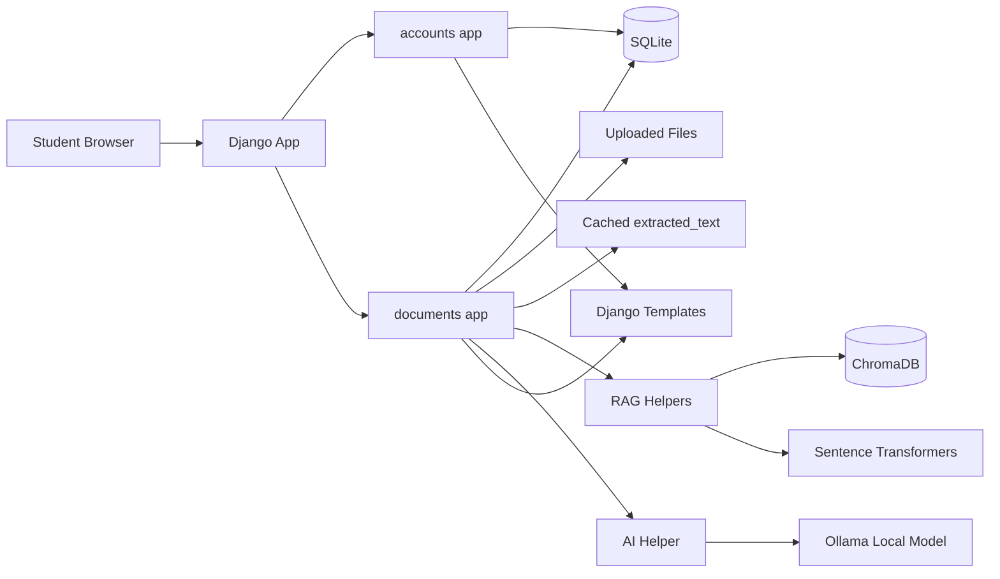
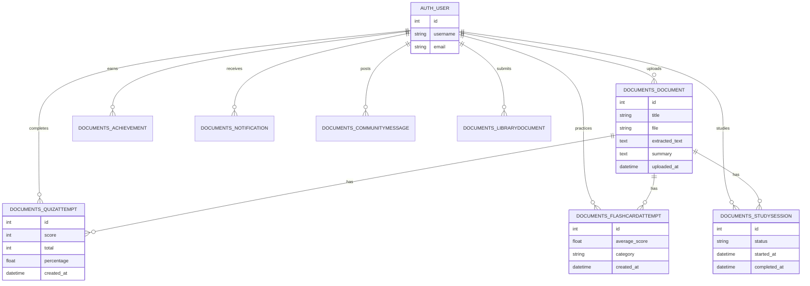
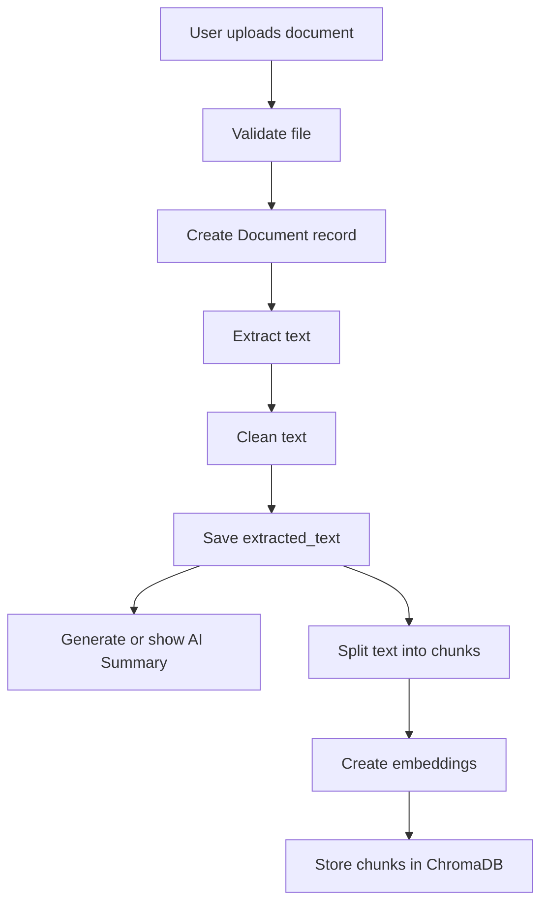
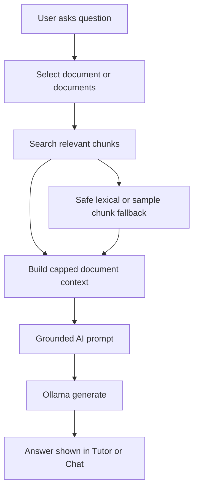
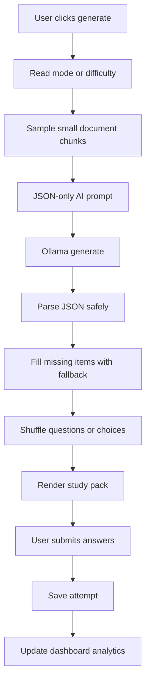
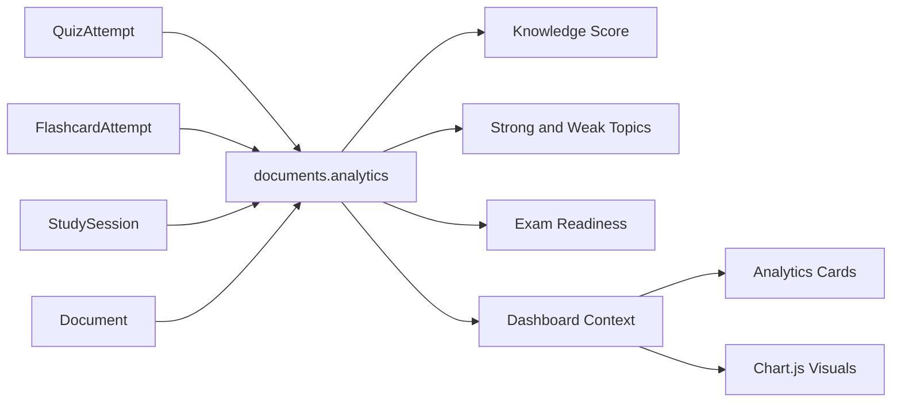
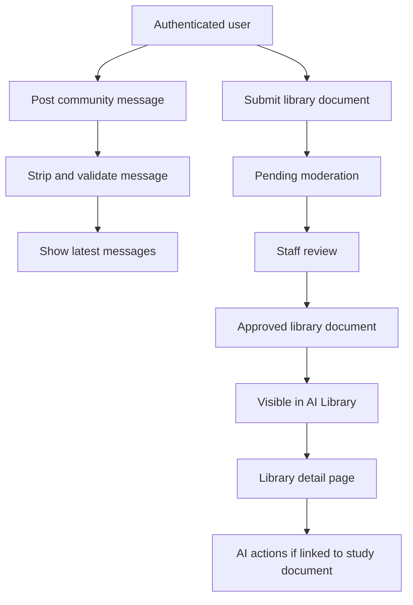

# StudentAI v1.0 Diagrams

This file contains Mermaid diagrams for GitHub and presentation slides.

## System Architecture Diagram

## Database ER Overview

## Upload to Extract Text to Summary to RAG Index Flow

## AI Chat / AI Tutor Flow

## Quiz / Flashcards / Exam Generation Flow

## Dashboard Analytics Flow

## Community / Library Flow

